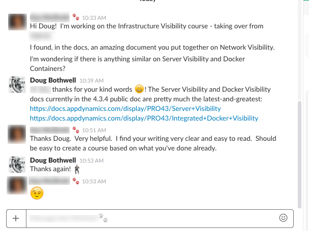
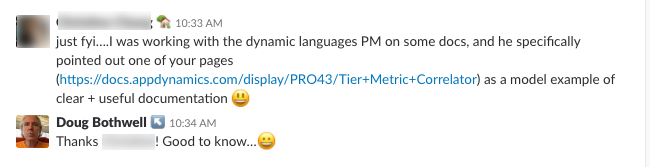

# douglas-j-bothwell.github.io

## Douglas J. Bothwell Portfolio

### UCSC Silicon Valley Extension

* [Completed sections](./pdf/doug-bothwell-ucsc-sv.completed-sections.2020-08-17.png)

* [Certificate in Computer Programming -- April 2019](./pdf/doug-bothwell-ucsc-certificate-computer-programming.png)

### Moogsoft (2018-Present)

* Primary writer for [Moogsoft Express](https://docs.moogsoft.com/express/index.html?lang=en), currently in beta, which extends Moogsoft's industry-leading AIOps (AI for IT Operations monitoring) technology to small and midsize organizations.

* Express API work:

   * Reorganized swagger files in coordination with engineering director.

   * Wrote Swagger conversion utility in Python that converts YAML files to JSON, organizes files by release number, and imports external schema referenced in swagger specs.

   * Created and ran extensive tests using Postman and wrote bash scripts to reproduce errors.

   * Reviewing Swagger specs for grammer, consistency, and usability (_in progress_)

* Wrote, tested, and deployed Express demo utility in Python that
   * Generates sample event and metric data based on parameterized randomization
   * Supports customization of hostnames, metrics, events, and anomaly severity levels
   * Sends generated data to Express ingestion API

* Evaluated Oxygen XML as a possible authoring tool

* Created XML repo that illustrates how you can perform various tasks using DITA and Oxygen:

   * Define global variables for company and product names

   * Define and apply conditions to show/hide content based on company and product name

   * Publish output to HTML and PDF  

### AppDynamics (2016-2018)

* Primary writer for the [Server Visibility](https://docs.appdynamics.com/display/PRO44/Server+Visibility), [Network Visibility](https://docs.appdynamics.com/display/PRO44/Network+Visibility), and [Docker Visibility](https://docs.appdynamics.com/display/CLOUD/Docker+and+AppDynamics+APM) products   (wrote ~1/4 of the Server docs, all of the Network docs, and most of the Docker docs)

* Wrote entire Network Visibility doc set from scratch for v1 release. Doc includes [Setup/Install Workflows](https://docs.appdynamics.com/display/PRO44/Set+Up+Network+Visibility), [Network Troubleshooting Workflows](https://docs.appdynamics.com/display/PRO44/Network+Visibility+Workflows+and+Example+Use+Cases), [Metric References](https://docs.appdynamics.com/display/PRO44/Network+Visibility+Metrics), and [Concepts](https://docs.appdynamics.com/display/PRO44/Network+Visibility+Concepts)'

   

* Documented [Tier Metric Correlator](https://docs.appdynamics.com/display/PRO44/Tier+Metric+Correlator) feature that enables DevOps engineers to identify performance outliers in blue-green deployment scenarios

* Collected, edited, and organized new and legacy content into a new [Monitoring Cloud Applications](https://docs.appdynamics.com/display/CLOUD/Monitoring+Cloud+Applications) doc set to highlight AppDynamics cloud monitoring capabilities

* Tested and documented workflows for [monitoring applications in Pivotal Cloud Foundry](https://docs.appdynamics.com/display/PCF/Pivotal+Cloud+Foundry) using AppDynamics

* Updated AppDynamics docs in [Pivotal Partner Documentation](https://docs.pivotal.io/partners/appdynamics/index.html) using markdown, git, and GitHub

* Refactored, organized, and collected [machine/server metric descriptions](https://docs.appdynamics.com/display/PRO44/Hardware+Resources+Metrics) in one central reference page

### Riverbed Technology (2012-2016)
* Rewrote and expanded [Metrics Reference](https://cdn.rawgit.com/douglas-j-bothwell/douglas-j-bothwell.github.io/a26c6854/appresponse-online-help/wwhelp/wwhimpl/js/html/wwhelp.htm#href=Main%20Documentation/metrics_concepts.html) with in-depth explanations and graphics to describe exactly how application, transport, and network metrics are calculated

* [Web Transaction Analysis](https://cdn.rawgit.com/douglas-j-bothwell/douglas-j-bothwell.github.io/a26c6854/appresponse-online-help/wwhelp/wwhimpl/js/html/wwhelp.htm#href=Main%20Documentation/wta.html) feature for performing in-depth analysis of web page usage

* [SteelFlow WTA](https://cdn.rawgit.com/douglas-j-bothwell/douglas-j-bothwell.github.io/a26c6854/appresponse-online-help/wwhelp/wwhimpl/js/html/wwhelp.htm#href=Main%20Documentation/sfwta.html)  feature for studying the impact of WAN optimization on web application performance

* Tested git repository and workflows. Wrote internal [git guide (PDF)](https://github.com/douglas-j-bothwell/douglas-j-bothwell.github.io/blob/master/pdf/Git%20for%20SteelCentral%20NPM%20Writers%20v4.pdf) for other writers to integrate doc source files and online help with engineering code base.

* Information architecture and [topic templates (PDF)](https://github.com/douglas-j-bothwell/douglas-j-bothwell.github.io/blob/master/pdf/bothwell_doug_info_architecture_sample.pdf) for new help infrastructure based on “Every Page is Page One” principles

### OPNET Technologies (1999-2012)

* Application troubleshooting by [analyzing network and tier delays](https://cdn.rawgit.com/douglas-j-bothwell/douglas-j-bothwell.github.io/760ffa6e/apptransactionxpert/User%20Guide/wwhelp/wwhimpl/js/html/wwhelp.htm#href=ACE_46_Delay.22.1.html#49315)

* Running analytical network simulations to [predict application performance](https://cdn.rawgit.com/douglas-j-bothwell/douglas-j-bothwell.github.io/760ffa6e/apptransactionxpert/User%20Guide/wwhelp/wwhimpl/js/html/wwhelp.htm#href=ACE_53_Pre_bas.27.01.html#49070)

* Installing [virtual appliances in VMWare Workstation (PDF)](https://github.com/douglas-j-bothwell/douglas-j-bothwell.github.io/blob/master/pdf/bothwell_doug_writing_sample3_appresponse_install_virtual_appliance_on_vmware_workstation.pdf)

* Using [advanced protocol decodes from packet-trace data](https://cdn.rawgit.com/douglas-j-bothwell/douglas-j-bothwell.github.io/760ffa6e/apptransactionxpert/User%20Guide/wwhelp/wwhimpl/js/html/wwhelp.htm#href=ACE_51_Protocol.23.5.html#114935) to analyze and troubleshoot HTTP/HTTPS, VoIP, video, database, and Citrix applications

* [Capturing application transactions in WAN-optimized environments](https://cdn.rawgit.com/douglas-j-bothwell/douglas-j-bothwell.github.io/760ffa6e/apptransactionxpert/User%20Guide/wwhelp/wwhimpl/js/html/wwhelp.htm#href=ace_wan_acceleration_overview.html#898312) to ensure visibility in both LAN and WAN segments

* [SP Guru Transport Planner User Guide](https://cdn.rawgit.com/douglas-j-bothwell/douglas-j-bothwell.github.io/c53f380e/spguru-transport-planner-online-help/spgtranplan/wwhelp/wwhimpl/js/html/wwhelp.htm?href=User/User-01-1.html) -- Optical network design tool for enterprise Service Providers
